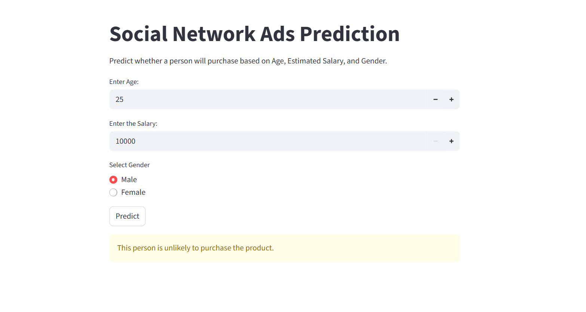

# Logistic Regression on Social Network Ads  

##  Project Overview  
This project demonstrates the application of **Logistic Regression** on the **Social Network Ads dataset** to predict whether a user will purchase a product based on **Age, Estimated Salary, and Gender**. It also includes a **Streamlit web app** for interactive predictions.  

---

## 🛠 Technologies Used  
- **Python**  
- **Pandas** → Data preprocessing  
- **Scikit-learn** → Model training and evaluation  
- **Streamlit** → Interactive web application  

---

##  Steps Performed in the Code  
1. Loaded and explored the dataset (`Social_Network_Ads.csv`).  
2. Preprocessed the data (cleaning, encoding categorical variables, feature scaling).  
3. Split the dataset into training and testing sets.  
4. Applied **Logistic Regression** for classification.  
5. Evaluated model performance using accuracy and confusion matrix.  
6. Built a **Streamlit app** for user input and real-time prediction.  

---

##  Result  
- The model successfully predicts whether a user will purchase the product based on input features.  
- Streamlit app provides an easy-to-use interface for making predictions.
   
  
---

## ▶ How to Run  

```bash
# Clone the repository
git clone https://github.com/akhilreddymuthyala/Logistic-Regression.git
cd Logistic-Regression

# Install dependencies
pip install -r requirements.txt

# Run the Streamlit app
streamlit run app.py
